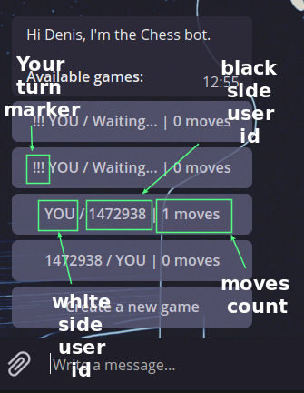
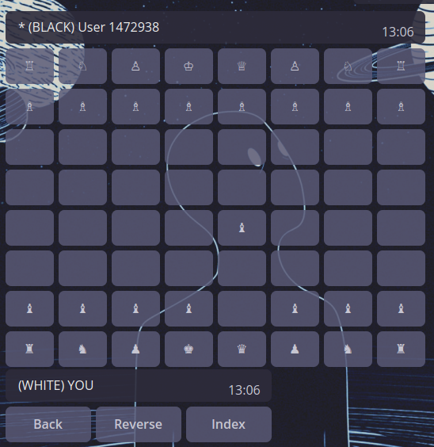

# The PvP chess bot for the Telegram

[](https://gitter.im/tg-chessbot/Lobby?utm_source=badge&utm_medium=badge&utm_campaign=pr-badge&utm_content=badge)

## Overview

A simple PvP chess game based on editing a reply markup of a chess board. The board built with callback buttons of an inline-keyboard. Bot uses the [`node-chess`](https://github.com/brozeph/node-chess) package, which is driven by the algebraic notation of moves.

#### Features:

- The chess board based on inline keyboard buttons and editing of reply markup.
- PvP - play with friends.
- All moves stored in the DB, so you can play a few games simultaneously.

## Usage

[Demo](https://t.me/chessy_bot) (WIP version).

### Commands

- `/start` - shows a list of available for join games and the `Create new game` button. *It is the default state.* 



Each list item contains id's of players and completed moves count. The first id is always for a white player. If it is your id, then there will be **`YOU`** word, instead of id. Your turn marker will be shown if the game needs your attention (your turn now).

Select the game you need now:



All buttons are clickable and boards will be updated right after you or your opponent had made a turn. The star near a player's id means it is a turn of a side where it placed now.

#### Buttons:

- **Back** - return to the list of games
- **Reverse** - *NOT IMPLEMENTED YET*
- **Index** - *NOT IMPLEMENTED YET*

## Install and run own bot instance

First clone this repository and install dependencies. Run in the terminal:

```bash
git clone git@github.com:Piterden/chessbot.git
cd chessbot
npm i
```

Then you need to create and fill up a new `.env` file:

```bash
cp .env.example .env
editor .env
```

Next migrate the DB:

```bash
node_modules/.bin/knex migrate:latest
```

Then run the dev mode:

```bash
npm run dev
```

## Built With

- [Telegraf.js](https://github.com/telegraf/telegraf) - Telegram bot framework for Node.js.
- [Node-Chess](https://github.com/brozeph/node-chess) - A simple node.js library for parsing and validating chess board position with an algebraic move parser.
- [Knex](https://github.com/tgriesser/knex) - A query builder for PostgreSQL, MySQL and SQLite3, designed to be flexible, portable, and fun to use.

## Contributing

Please read [CONTRIBUTING.md](https://gist.github.com/PurpleBooth/b24679402957c63ec426) for details on our code of conduct, and the process for submitting pull requests to us.

## Authors

- **Denis Efremov** - *Code|Idea* - [Piterden](https://github.com/Piterden)

## License

This project is licensed under the MIT License - see the [LICENSE.md](LICENSE.md) file for details
