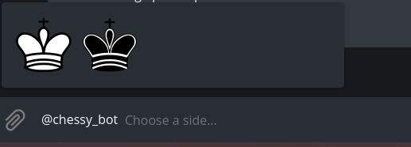
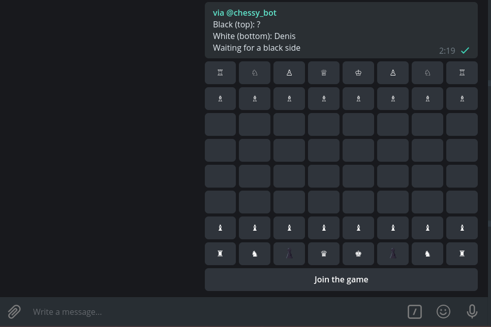
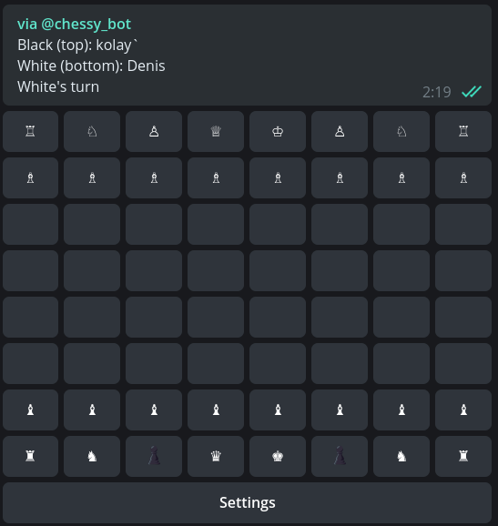

# The PvP chess bot for the Telegram

[](https://travis-ci.com/Piterden/chessbot)

## Overview

A simple PvP chess game based on inline message and edit a reply markup of a chess board. The board built with callback buttons of inline-keyboard. Bot uses the [`node-chess`](https://github.com/brozeph/node-chess) package, which is driven by the algebraic notation of moves (PGN).

#### Features:

- Inline query to start the game.
- PvP - play with friends.
- Bot works in any group or private chat.
- All moves stored in the DB, so you can play a few games simultaneously.

[**Demo**](https://t.me/chessy_bot) (WIP version)

## Usage

To play chess simply type `@chessy_bot[SPACE]` to your telegram's message input box.



Then choose a side you want to play with. You will see an inline message with a chess board and a **"Join to game"** at the bottom.



When someone join your game, this will be displayed in the status message. Also the **"Join to game"** button will become **"Settings"**.



Now everything is ready to start the game. Whites should make the first turn. To move your pieces you should easily select a piece you want to move and then select a destination from displayed available to move squares.

> **WARNING!!!**
>
> The board is rotating each turn by default! The active player always placed at the bottom!

## Install and run own bot instance

First clone this repository and install dependencies. Run in the terminal:

```bash
git clone git@github.com:Piterden/chessbot.git
cd chessbot
npm i
```

Then you should create and fill up a new `.env` file:

```bash
cp .env.example .env
editor .env
```

Next migrate the DB:

```bash
./node_modules/.bin/knex migrate:latest
```

Then run the dev mode:

```bash
npm run dev
```

## Built With

- [Telegraf.js](https://github.com/telegraf/telegraf) - Telegram bot framework for Node.js.
- [Node-Chess](https://github.com/brozeph/node-chess) - A simple node.js library for parsing and validating chess board position with an algebraic move parser.
- [Knex](https://github.com/tgriesser/knex) - A query builder for PostgreSQL, MySQL and SQLite3, designed to be flexible, portable, and fun to use.

## Contributing

Please read [CONTRIBUTING.md](https://gist.github.com/PurpleBooth/b24679402957c63ec426) for details on our code of conduct, and the process for submitting pull requests to us.

## Authors

- **Denis Efremov** - *Code|Idea* - [Piterden](https://github.com/Piterden)
- **kolay** *Code|Consulting* - [kolay-v](<https://github.com/kolay-v>)

## License

This project is licensed under the MIT License - see the [LICENSE.md](LICENSE.md) file for details
